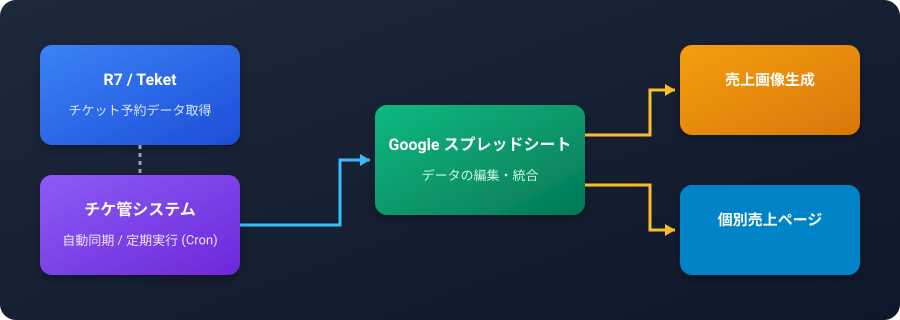
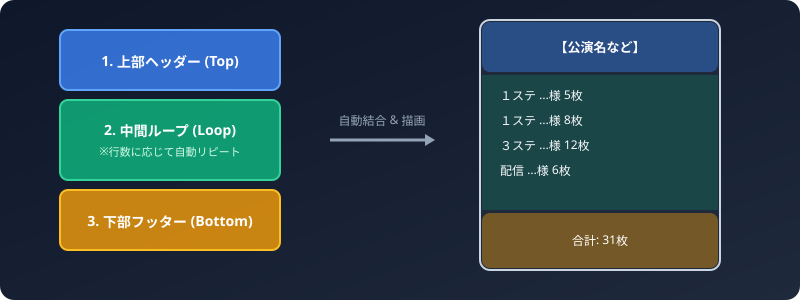
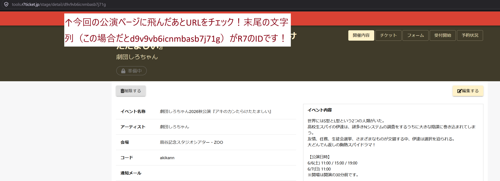
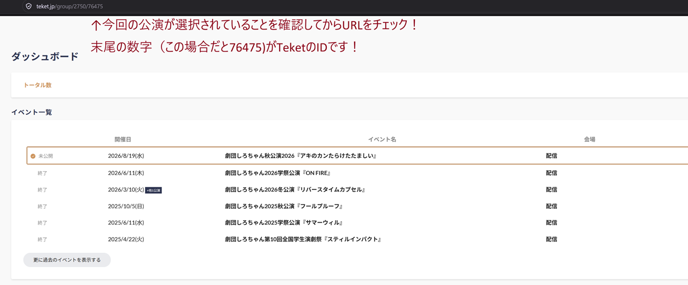

# 🎭 チケ管システム 利用マニュアル (README.md)

チケ管システムの操作ガイドです。  
R7およびTeketからのチケット予約データ自動取得、Googleスプレッドシートへの反映、売上画像の生成、個別予約状況ページの公開などを行えます。


---

## 📑 目次
1. [システム概要・全体の流れ](#1-システム概要全体の流れ)
2. [各機能の使い方](#2-各機能の使い方)
   - [① スプシ更新](#①-スプシ更新)
   - [② 売上画像生成](#②-売上画像生成)
   - [③ 環境変数エディタ](#③-環境変数エディタ)
   - [④ サービスアカウント設定](#④-サービスアカウント設定)
   - [⑤ 定期実行 (Cron)](#⑤-定期実行-cron)
   - [⑥ 個別予約確認ページ (/status/<名前>)](#⑥-個別予約確認ページ-status名前)
3. [スプレッドシートのデータ形式 (Ticket / Members)](#3-スプレッドシートのデータ形式-ticket--members)
   - [Ticket シートのデータ形式](#ticket-シートのデータ形式)
   - [Members シートのデータ形式](#members-シートのデータ形式)
   - [gid とは何か・確認方法](#gid-とは何か確認方法)
   - [データ整形の注意点](#データ整形の注意点)
4. [トラブルシューティング & よくある質問](#4-トラブルシューティング--よくある質問)

---

## 1. システム概要・全体の流れ

チケ管システムは、以下のステップで公演チケットの予約・売上管理を自動化します。



- **R7 / Teket**: 予約フォームから予約データを自動収集します。
- **Googleスプレッドシート**: 収集された予約データを整理・集計します。
- **売上画像生成**: 売上画像を一括書き出しします。
- **個別ページ**: スタッフが自身の予約状況をスマホからリアルタイムに確認できます。

---

## 2. 各機能の使い方

### ① スプシ更新

TeketやR7から最新の予約情報をスクレイピングし、スプレッドシートへ書き込みます。

1. サイドバーから **「スプシ更新」** タブを開きます。
2. 右上またはパネル内の **「実行」** ボタンを押します。
3. 実行ログがリアルタイムにターミナル画面へ流れます。
4. **【R7 ワンタイムURL認証の場合】**
   - R7のログインURL認証が要求された場合、画面上部に黄色い通知バナーが表示されます。
   - メールに届いたログイン用URLをコピーし、入力欄に貼り付けて **「送信」** を押してください。
5. 「処理が正常に完了しました」と表示されれば更新完了です。

> 💡 **ポイント**: 途中で処理を中断したいときは「強制停止」ボタンを押すことができます。

---

### ② 売上画像生成

スプレッドシートの売上データを元に売上画像を生成してZIPファイルでダウンロードします。



#### 仕組み
- **上部ヘッダー (Top)**: 公演ロゴやタイトルを配置。
- **中間ループ (Loop)**: ステージ・予約内容の行数に応じて自動的に高さを伸縮。
- **下部フッター (Bottom)**: 合計枚数などを表示

#### 操作手順
1. **背景画像のカスタマイズ**:
   - 必要に応じて「上部」「中間ループ」「下部」の画像をドラッグ＆ドロップして変更します。
2. **フォントの変更**:
   - ドロップダウンからフォントを選択するか、お好みのフォントファイル（`.ttf` / `.otf`）をアップロードします。
3. **画像の生成**:
   - **「売上画像を生成」** ボタンをクリックします。
4. **ダウンロード**:
   - 生成完了後、**「ZIPをダウンロード」** ボタンから全役者の画像をまとめて保存できます。

---

### ③ 環境変数エディタ

システムの動作に必要な各種設定（スプレッドシートURLやアカウント情報）を編集できます。




| 項目名 | 説明 | 例 / 形式 |
| :--- | :--- | :--- |
| `SPREADSHEET_URL` | 同期対象のGoogleスプレッドシートURL | `https://docs.google.com/spreadsheets/d/...` |
| `SPREADSHEET_TICKET_GID` | Ticket データのワークシート gid | `934641883` |
| `SPREADSHEET_MEMBERS_GID` | Members データのワークシート gid | `708315325` |
| `TEKET_EVENT_ID` | TeketのイベントID | `12345` |
| `R7_EVENT_ID` | R7のイベントID | `9876` |

- 値を書き換えたら、 **「保存」** ボタンをクリックしてください。

---

### ④ サービスアカウント設定

GoogleスプレッドシートAPIへのアクセスに必要な `service_account.json` を管理します。

1. Google Cloud Console で作成したサービスアカウントの秘密鍵JSONを用意します。
2. **「service_account.json のアップロード」** エリアにファイルをドラッグ＆ドロップします。
3. アップロード後、クライアントメールアドレスやプロジェクトIDが画面に表示されます。
4. **【重要】スプレッドシートへの権限付与**:
   - 画面に表示されている「クライアントメールアドレス」をコピーし、対象のGoogleスプレッドシートの共有設定で **編集者** として追加してください。

---

### ⑤ 定期実行 (Cron)

サーバーのCron機能を利用して、定期的にチケット情報を自動同期します。

- **実行間隔の設定**:
  - 「毎日指定時刻（例: 09:00）」
  - 「N時間ごと（例: 2時間ごと）」
  - 「N分ごと（例: 15分ごと）」
  - 「カスタムCron式」
- 設定を変更したら **「スケジュール設定を保存」** をクリックしてください。
- サーバーの crontab に設定するコマンド例も表示されます。

---

### ⑥ 個別予約確認ページ (`/status/<名前>`)

スタッフが自身の予約状況を閲覧できる専用ページです。

- **URL形式**: `https://**/status/{本名}/{ランダム文字列}`
- **機能**:
  - ステージ・券種別内訳
  - お客様のお名前一覧

---

## 3. スプレッドシートのデータ形式 (Ticket / Members)

チケ管システムが「売上画像生成」や「個別予約確認ページ」で正しくデータを集計・表示するために、スプレッドシート内に **Ticket** および **Members** のデータを用意し、以下の形式に整形してください。

---

### Ticket シートのデータ形式

チケットの予約明細を管理するシートです。  
スプレッドシートの関数（QUERY関数やFILTER関数など）を使って、取得した予約データを以下のヘッダー列形式（`名前`, `種別`, `購入者`, `数`）に整形してください。

| 列名（1行目） | 必須 | 説明 | 例 |
| :--- | :---: | :--- | :--- |
| **名前** | ○ | 扱いスタッフの本名 | `劇団太郎` |
| **種別** | ○ | ステージ名 | `１ステ`, `３ステ`, `配信`|
| **購入者** | ○ | 予約・購入者のお名前 | `山田太郎`, `田中花子` |
| **数** | ○ | 予約・購入枚数（数値） | `1`, `2`, `5` |

#### 例:
| 名前 | 種別 | 購入者 | 数 |
| :--- | :--- | :--- | :---: |
| 劇団太郎 | １ステ | 山田太郎 | 2 |
| 劇団太郎, 劇団花子 | １ステ | 佐藤次郎 | 1 |
| 劇団花子 | ３ステ | 鈴木三郎 | 3 |

---

### Members シートのデータ形式

役者・スタッフのメンバー情報および個別確認ページの認証キーを管理するシートです。

| 列名（1行目） | 必須 | 説明 | 例 |
| :--- | :---: | :--- | :--- |
| **NAME** | ○ | メンバーの本名・フルネーム（Ticketシートの「名前」と完全一致） | `劇団太郎` |
| **ID** | ○ | 個別ページの認証用ランダム文字列（秘密キー） | `a8f9x2k1` |

#### 例:
| NAME | ID |
| :--- | :--- |
| 劇団太郎 | a8f9x2k1 |
| 劇団花子 | m3k9p8q4 |

---

### gid とは何か・確認方法

#### gid とは？
- **gid (Grid ID)** とは、Googleスプレッドシート内の各ワークシート（タブ）ごとに自動で割り振られる**固有の数値ID**です。
- シート名を変更しても gid は変わらないため、プログラムから対象のシートを安全・確実に特定するために使用されます。

#### gid の確認手順
1. パソコンのブラウザで対象の Google スプレッドシートを開きます。
2. 下部のシートタブから、確認したいワークシート（例: `Ticket` や `Members`）をクリックして選択します。
3. ブラウザ上部のアドレスバー（URL）を確認します。
4. URLの末尾にある `#gid=` に続く**数字部分**がそのシートの gid です。

```text
https://docs.google.com/spreadsheets/d/1A2B3C4D5E6F.../edit#gid=934641883
                                                              ▲▲▲▲▲▲▲▲▲
                                                              この数字が gid
```

- 確認した gid を、**「環境変数エディタ」** の `SPREADSHEET_TICKET_GID` および `SPREADSHEET_MEMBERS_GID` に入力して保存してください。

---

### データ整形の注意点

> ⚠️ **重要ポイント**:
> 1. **ヘッダー列名の完全一致**:
>    - 1行目の列名（`名前`, `種別`, `購入者`, `数`, `NAME`, `ID`）は大文字・小文字や余計なスペースを含めず完全一致させてください。
> 2. **名前の表記ゆれ防止**:
>    - `Members` シートの `NAME` と `Ticket` シートの `名前` は完全に一致している必要があります。前後の空白（スペース）の混入にご注意ください。
> 3. **複数人扱いの按分（均等分割）**:
>    - Ticketシートの「名前」に複数の人名をカンマ（半角 `,` または全角 `，`）で区切って記載すると、記載人数で枚数が自動的に均等分割（例: 2名なら 1/2 ずつ）されます。
> 4. **ID（認証キー）のセキュリティ**:
>    - `Members` シートの `ID` は各メンバーの専用URL（`/status/名前/ID`）の認証キーとなります。第三者に推測されにくい英数字の組み合わせを設定してください。

---

## 4. トラブルシューティング & よくある質問

#### Q. スプシ更新で「SpreadsheetNotFound」や権限エラーが出る
> **A.** `service_account.json` のクライアントメールアドレスが、対象のスプレッドシートに「編集者」権限で共有されているか確認してください。また、`.env` の `SPREADSHEET_URL` が正しいか確認してください。

#### Q. 売上画像生成や個別ページでデータが表示されない / gid エラーが出る
> **A.** `Ticket` および `Members` シートの `gid` が環境変数エディタで正しく設定されているか確認してください。また、1行目のヘッダー列名が正しいかご確認ください。

#### Q. R7のログインがタイムアウトする
> **A.** R7から届くログインリンクには有効期限があります。メール受信後速やかにURLをコピーして画面上部の通知バナーに入力してください。

#### Q. 画像生成で文字化けやレイアウト崩れが起きる
> **A.** フォント設定から日本語対応のフォント（Noto Sans JPやRounded M+など）が選択されているか確認してください。

